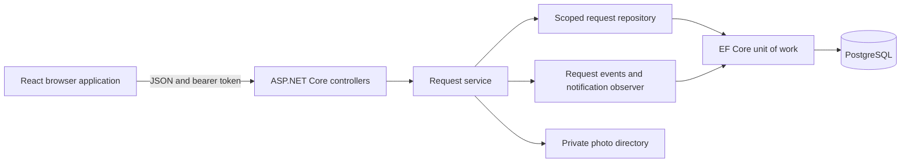
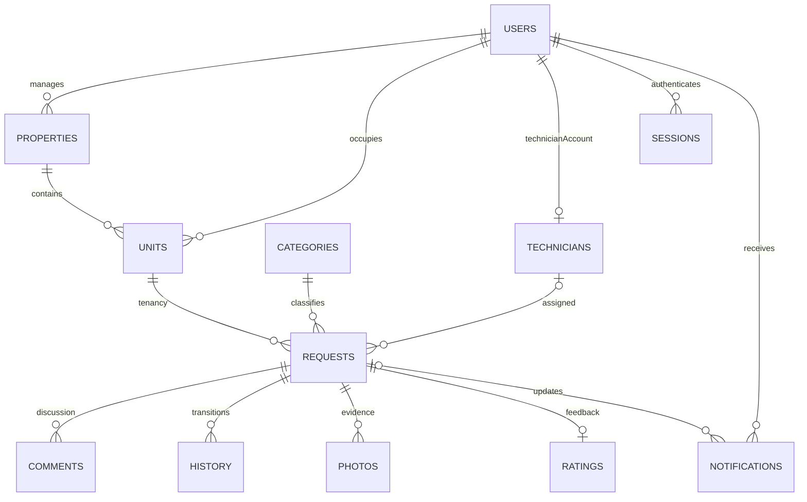

# Requirements and implementation evidence

This maps the supplied Part 1 document `INSY7315_WIL (2).pdf` to the local Task 2 implementation. User story numbers refer to section 2.2 of that document. React, ASP.NET Core and PostgreSQL are the active stack.

| Part 1 stories | Implementation | Evidence |
| --- | --- | --- |
| Tenant 1–2: register, sign in, linked properties | Tenant-only public registration; admin tenant links; role-scoped property API | API registration/access scenarios; browser admin onboarding |
| Tenant 3–6: report, photo, urgency, tracking | Report form; private image upload; request cards and history | Browser request submission; API photo validation and lifecycle |
| Tenant 7–8: notifications and communication | Database notifications; comments; focus and interval refresh | API lifecycle and browser notification checks |
| Tenant 9–10: confirm and rate | Confirm or reopen completed work; one rating per completed/closed request | API rework, closure and duplicate-rating checks; browser confirmation then rating |
| Manager 11–12: properties and tenants | Scope by property manager; contact details for linked tenants | API access scope; browser directory loading |
| Manager 13–15: review, prioritise, assign and monitor | Validated transitions, urgency, technician selection, visit date and reports | API lifecycle and browser assignment |
| Manager 16–18: communicate, approve and report | Comments, closure, scoped SQL aggregates, CSV export | API workflow/access tests; browser report rendering |
| Technician 19–22: assigned jobs, accept/reject, attachments and status | Assignment-based access; private photos; accept, reject, hold and resume | API access and transitions; browser accept/complete |
| Technician 23–25: before/after photos, notes and completion | Typed photo evidence, comments, completion handover | API image/scoping tests and browser completion; before/after options implemented |
| Administrator 26–30: accounts, properties, categories, permissions and reporting | Create/edit/archive forms; resets/deactivation; current-role checks; full reports | API onboarding/access tests; browser all admin views and create forms |
| Additional admin role duties | Technician specialisation and organisation settings | Implemented forms and endpoints; browser view checks |

## Architecture

React calls same-origin JSON endpoints. ASP.NET Core controllers authenticate and validate input. `RequestService` enforces the maintenance state machine. `IRequestRepository` provides role-scoped access to requests, and EF Core/Npgsql persist the relational model in PostgreSQL. Reference-data administration uses the scoped EF context directly.

The Repository pattern centralises request ownership checks. The Observer pattern adds in-app notifications to the same EF unit of work as the request transition and audit history. They commit together; an exception prevents a partial database save. File writes use cleanup on a failed database save, but filesystem and database storage are not a distributed transaction. Backups therefore include both stores.

Core entities are users, properties, tenant-unit links, categories, technicians, requests, comments, status history, photos, ratings, notifications, refresh sessions and workspace settings. Each request retains its original tenancy, enforced by a composite foreign key across unit ID, property ID and tenant ID. Active unit names are unique within a property. A request has at most one rating. Referenced records use restrictive foreign keys and archive flags. PostgreSQL `xmin` provides optimistic concurrency for requests and refresh sessions.

## Verification and remaining deployment evidence

- **Security:** hashed passwords, server role/object checks, parameterised queries, account lockout, rate limits, rotating refresh cookies, revocation, input limits, image decoding and security headers are implemented. This is not a penetration-test certification. Email verification, password-recovery email, external push/email delivery and malware scanning are not implemented; admin password reset and in-app notifications are available.
- **Performance and scale:** paged request search, full dashboard/report aggregates and scheduled-work queries operate over the complete authorised dataset. The older unpaged `/requests` endpoint remains capped at 500 for compatibility; the UI no longer relies on it. Notifications show the latest 100. A local benchmark with 1,000 added properties and 10,000 requests completed 160 reads and 40 creates with a 36 ms 95th percentile and zero errors. Shared photo storage, production load/soak tests and hosted measurements remain necessary for the 5,000-property scaling plan.
- **Usability and accessibility:** 73 automated page/viewport scans pass at desktop, 768, 390 and 320 pixels, including contrast checks. Keyboard login, dialog focus and recovery paths pass. Chrome and Edge workflows pass. A first-time-user study, manual screen-reader audit, previous-major-version checks and Safari/physical Android tests remain outstanding.
- **Availability and hosting:** production-mode publishing, new-database bootstrap, private files and local database/photo restore are verified. Docker execution, cloud topology, TLS/database connectivity in that environment and 99% business-hours uptime need hosted evidence. Part 1's CDN/object storage/WAF/managed identity/network isolation/central monitoring design remains to be provisioned or explicitly reconciled with the chosen deployment.
- **GitHub:** existing history is preserved. Both workflows pass actionlint. CI now includes API, main browser, recovery and accessibility checks. No destination workflow run or protected-branch policy can be claimed before pushing and configuration. Use feature branches into `develop`, followed by a reviewed release to `main`. New commits retain their actual dates and contribution authors.

Full findings, measurements, rubric mapping and remaining evidence are in [AUDIT-2026-10-05.md](AUDIT-2026-10-05.md).

## Demonstration route

Use isolated sessions for the four demo roles. Tenant submits a plumbing issue with a photo. Manager reviews and assigns Johan, optionally scheduling a visit. Technician accepts, adds work notes/evidence and completes it. Tenant confirms resolution and rates it. Show notifications and the audit history, then demonstrate admin user/property/tenant-link management and manager reports. Use the revised Word script for five timed speaking parts.
